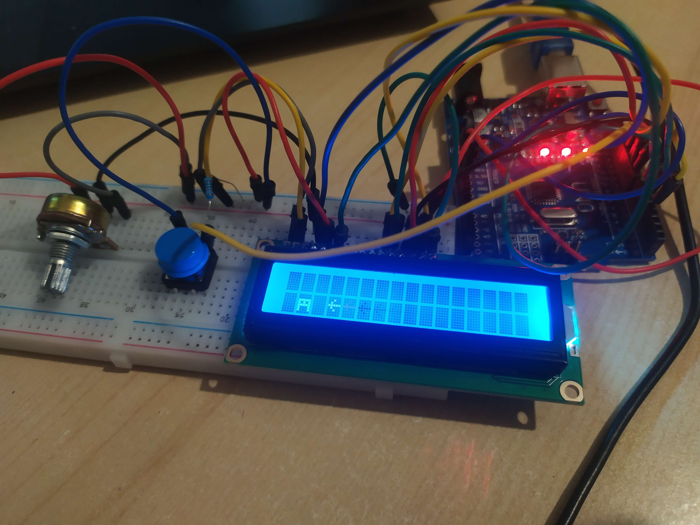

# Trex Game

A simple Trex game inspired by the Chrome browser's offline mode.

## About
You can beat the game if and when your character jumps over all arrows and absorbs all "friendly" blocks.
### Features:
* Speed of arrows is variable.
* Occurrence of "good" and "bad" characters is pseudo-random
* Game CAN be beaten
* You can reset it if you make a long press on button
* You can set contrast of a screen
* Every once in a while a night will come => Backlight will be turned off

## Demo

## Acknowledgements

- The Chrome browser for inspiring this project.
- Any libraries or assets used in the game.
